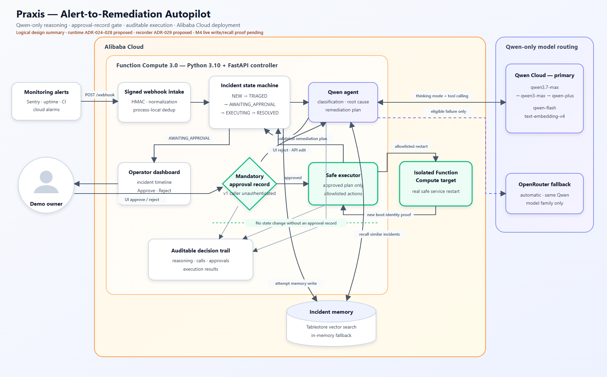

# Praxis

Praxis is a Qwen-powered alert-to-remediation autopilot: it accepts a signed operational alert, investigates it, proposes a risk-labelled plan, waits for an explicit approval record, executes only the approved actions, and then attempts to record reusable incident memory with the outcome visible in its trail.

- **Live application:** [https://praxis.kopachelli.dev](https://praxis.kopachelli.dev)
- **API health:** [https://praxis.kopachelli.dev/healthz](https://praxis.kopachelli.dev/healthz)

> **Submission integrity:** the Qwen Cloud Hackathon entry is frozen while judging is in progress. This working tree contains post-deadline hardening and must not be presented as the original submitted snapshot. Do not push changes to linked materials, replace the video, or edit the Devpost entry unless the organizer grants written permission or judging ends.

## Runtime boundary

Praxis calls **Qwen-family models only** at runtime:

- Qwen Cloud is always first: `qwen3.7-max` → `qwen3-max` → `qwen-plus` for reasoning, `qwen-flash` for classification, and `text-embedding-v4` at 1024 dimensions for memory.
- OpenRouter is an availability fallback only, serving the corresponding Qwen models. It is never the normal primary route.
- Provider transitions are bounded, recorded in the incident trail, and restricted to accepted authentication, availability, quota, server-error, and timeout failures.
- The application is deployed on Alibaba Cloud Function Compute 3.0; persistent semantic memory uses Alibaba Cloud Tablestore.

Codex running GPT-5.6 Sol was used as a development tool. That build-time tooling is separate from the product runtime and does not appear in Praxis model routing.

## Safety model

No state-changing tool can run until the API has recorded approval for the exact proposed plan. The state machine enforces this boundary: `AWAITING_APPROVAL` is the only route into `EXECUTING`. Accepted ADR-025 adds an application-level bearer boundary to every incident read and approval mutation; the server authenticates the single `demo-operator` role without accepting caller-controlled attribution. The UI starts locked, holds the entered token only in JavaScript memory, and still requires the separate native confirmation before approval. The public root, health endpoint, and HMAC-signed webhook retain their separate public boundaries.

The one real write adapter restarts only the dedicated, disposable `praxis-demo-target` Function Compute function. Caution and dangerous tools remain visibly labelled dry runs. Rejecting or editing a plan returns it to Qwen for regeneration and never executes the rejected proposal.

## Current status

This table describes the post-deadline working tree, not the frozen hackathon snapshot or an assertion that every local hardening change is already live. The public URL is the last authorized Function Compute revision and currently predates the recording-ready accessibility, memory-similarity, and UI-contract updates. The read-only marker check in `docs/DEMO_AND_SUBMISSION.md` must pass after a permitted redeploy before screenshots or video are captured.

| Area | Current evidence |
| --- | --- |
| Intake and incident core | Signed webhook intake, normalization, bounded request bodies, state machine, and trace-correlated timeline are implemented and tested. Same-key deduplication and active incidents are process-local; caller-supplied idempotency identity is not yet bound into the body signature, and supplied keys are not yet normalized or independently bounded. Proposed ADR-026/027 cover authenticity/durability; proposed ADR-030 covers parsing and retention bounds. |
| Qwen agent | Qwen Cloud-first classification, thinking-mode triage, tool calling, strict plan validation, and bounded same-Qwen fallback are implemented and tested locally. Accepted ADR-024 adds a 1-running/3-pending FIFO controller, 300s pending expiry, 240s whole-job deadlines, and one provisioned non-idle controller/target instance in the manifests. Live capacity verification remains required after redeploy. |
| HITL and execution | The locked browser UI uses a memory-only operator bearer token; the API protects incident reads plus approve/reject/edit. Regeneration, the isolated FC restart adapter, and dry-run adapters are implemented. Final camera-quality restart evidence still requires a freshly staged incident and the owner's two visible approval actions; the new auth boundary is not a live claim until both public origins pass post-deploy probes. |
| Tablestore memory | The 1024-d Float32/cosine table and index, dedicated least-privilege FC role, deployed runtime configuration, resolution-write implementation/tests, semantic-recall implementation/tests, and read-only in-instance schema smoke are green. Delivery is currently one best-effort post-resolution attempt, and stored text is plan-derived rather than verified-execution-derived; proposed ADR-019/020 cover those gaps. The deployed resolved-row plus fresh-recurrence exit proof remains human-gated. |
| Submission assets | The architecture export and standalone Alibaba proof are present. Video, screenshots, and publication work remain separate from the locked Devpost entry. |

The remaining human-gated evidence is deliberate: the project never synthesizes or bypasses an operator approval for the sake of a test or recording.

## Architecture



This is a logical summary of the accepted Qwen/Alibaba design, not live deployment proof. ADR-024's active FC lifecycle/admission bounds and ADR-025's single-operator authentication are implemented in the working tree; the current public revision must still pass the live deployment and origin probes before those capabilities are recorded. Signed/durable idempotency authority, uncertain tool-outcome reconciliation, and least-privilege recorder access remain proposed in ADR-026 through ADR-029; M4's real write-and-distinct-recurrence proof is still open.

1. A source sends a signed alert to the FastAPI controller on Function Compute.
2. Praxis normalizes it, applies process-local same-key deduplication, acquires bounded lifecycle capacity, and acknowledges the webhook after queuing triage. The accepted manifests keep exactly one provisioned controller instance non-idle; inside it, one job runs and up to three wait FIFO under 300s/240s pending/job deadlines. A full queue fails before incident mutation, while a retained duplicate bypasses admission. Live control-plane verification remains required after deploy.
3. Qwen recalls any similar Tablestore incident, classifies the alert, gathers read-only tool evidence, and produces a schema-validated remediation plan.
4. The operator unlocks the timeline with the memory-only bearer token, then approves or rejects; the same protected HITL endpoint also accepts a strict structured edit request for correction and regeneration.
5. Only an approved plan enters the executor. Results are appended to the decision trail; after the incident reaches `RESOLVED`, Praxis makes a non-fatal embedding and Tablestore write attempt and records whether memory was stored or unavailable.

The controller deliberately uses process-local active-incident state for the single-operator demo. Reserved concurrency caps each function at one, while the accepted provisioned `defaultTarget: 1` and `alwaysAllocateCPU: true` configuration keeps both controller and isolated target active after a response. The live verifier must prove both layers; a manifest alone is not evidence. An FC recycle still clears active incidents, so stage an approval candidate immediately before human review. Tablestore is currently the cross-restart semantic-memory layer, while proposed ADR-027 covers durable operational incidents/idempotency.

See [ARCHITECTURE.md](docs/ARCHITECTURE.md) for the detailed flow and state machine, and [API_CONTRACT.md](docs/API_CONTRACT.md) for exact request and response semantics.

## API

| Method | Path | Purpose |
| --- | --- | --- |
| `GET` | `/` | Public locked shell for the dependency-free incident timeline and approval UI |
| `POST` | `/webhook` | HMAC-verified alert intake with process-local same-key deduplication |
| `GET` | `/incidents` | Bearer-protected newest-first incident summaries |
| `GET` | `/incidents/{id}` | Bearer-protected incident, plan, memory match, and complete trail |
| `POST` | `/incidents/{id}/approve` | Bearer-protected `approve`, `reject`, or `edit` decision for the server-owned operator role |
| `GET` | `/incidents/{id}/memory-match` | Bearer-protected top semantic prior-incident match or `null` |
| `GET` | `/healthz` | Deployment and resolved-model health proof |

There is no public manual planning endpoint. Initial planning starts only after accepted signed intake; correction planning starts only through the HITL reject/edit flow.

## Local setup

Requirements:

- Python 3.10
- A general Qwen Model Studio API key for the Singapore/International endpoint
- An OpenRouter key if same-Qwen fallback should be available
- Docker and Serverless Devs only for building/deploying the Function Compute bundle
- Alibaba Cloud credentials and a Tablestore instance only when using persistent memory locally or provisioning cloud resources

Create the environment on macOS/Linux:

```bash
python3.10 -m venv .venv
source .venv/bin/activate
python -m pip install --upgrade pip
python -m pip install -r requirements.txt
cp .env.example .env
```

Or on Windows PowerShell:

```powershell
py -3.10 -m venv .venv
.\.venv\Scripts\Activate.ps1
python -m pip install --upgrade pip
python -m pip install -r requirements.txt
Copy-Item .env.example .env
```

Fill the ignored `.env` without printing or committing it. For a complete local agent flow, set at least:

- `DASHSCOPE_API_KEY` — a general Model Studio key, **not** a Qwen coding-plan key
- `OPENROUTER_API_KEY` — fallback only
- `WEBHOOK_SIGNING_SECRET`
- `PRAXIS_OPERATOR_TOKEN` — a random 32–4096 visible-ASCII value with at least eight distinct characters, no whitespace, and no placeholder form; never place it in a URL, document, recording prompt, screenshot, log, or browser storage
- `PRAXIS_DEMO_TARGET_URL` and a random 32–4096 visible-ASCII-character `PRAXIS_DEMO_TARGET_TOKEN` with at least eight distinct characters and no whitespace or placeholder form only when testing the real isolated adapter
- the Tablestore endpoint, instance, and local Alibaba credentials when `MEMORY_BACKEND=tablestore`

The app and operational wrappers load the repository `.env` without overriding variables already present in the process environment.
In production, startup fails closed when provider credentials, the webhook signing secret, the operator token, or the isolated-target token are missing or trivially weak (short, low-diversity, whitespace-containing, non-visible-ASCII, overlong where bounded, or obvious placeholders). The same target-token strength check runs inside the isolated target; its FC manifest fixes `APP_ENV=production`, so an absent or blank deployed token prevents the target from starting. A missing local-development target token stays inert and cannot authorize a restart. Validation errors identify only the environment variable, never its value. Operator-auth failures use one fixed trace-bearing `401` challenge and never disclose incident existence or create work. Request-boundary error logs retain the fixed event name, trace/incident context, and exception type while omitting exception messages and tracebacks that could contain secrets.

Run locally:

```bash
python -m uvicorn app.main:app --reload --port 8000 --log-config app/uvicorn_log_config.json
```

Then open `http://localhost:8000`, enter the local operator token to unlock the incident UI, check the public `http://localhost:8000/healthz`, and fire the deterministic signed alert:

```bash
python scripts/fire_alert.py
```

## Tests

```bash
python -m pytest -q
python -m compileall -q app scripts tests deploy
```

The suite covers signed intake, process-local same-key deduplication, provider routing and deadlines, plan/tool contracts, the approval-record gate, execution, Tablestore memory, FC wrappers, IAM redaction, and the standalone Alibaba proof.

After five distinct owner-authorized deployed rehearsals, place their complete
incident-detail responses in one local `{"incidents":[...]}` envelope and verify
the explicit NFR-2 triage-to-plan target without making a network request:

```bash
python scripts/check_plan_latency.py --input <local-evidence.json>
```

The command passes only when the nearest-rank p95 from the server-owned incident
creation timestamp to its exact `plan_ready` trail event is strictly below 30
seconds. Local fixtures validate the calculation but are not deployed evidence.

## Tablestore and the FC execution role

Local provisioning uses credentials from the ignored `.env`. The deployed controller receives short-lived credentials from the dedicated `praxis-fc-tablestore-role`; long-lived Alibaba keys are never rendered into `deploy/s.yaml`.

Inspect the exact role and policy without changing them:

```bash
python scripts/fc_role.py inspect
```

After reviewing the accepted table-scoped policy, create or reconcile the role and copy its allowlisted `role_arn` result into `FC_EXECUTION_ROLE_ARN`:

```bash
python scripts/fc_role.py ensure
```

`ensure` is a cloud IAM mutation. It reads before writing, fails closed on trust,
policy-document, or attachment-set drift, and refuses to mutate a role that has
any unexpected system or custom policy attached. The one accepted custom policy
grants only `DescribeTable`, search-index inspection, `PutRow`, and `Search` on
`praxis_memory`.

Schema DDL stays outside the request runtime:

```bash
python scripts/provision_memory.py
python scripts/probe_memory.py
```

The first command idempotently provisions and verifies `praxis_memory` plus
`praxis_memory_index`; the second is read-only and exits nonzero unless the
table, primary key, retention options, exact index-field set, vector contract,
filter field, and synchronization phase all match. Set `MEMORY_BACKEND=inmem`
for a non-persistent local fallback, but Qwen Cloud embeddings are still
required for memory operations.

## Build and deploy to Function Compute

The custom runtime needs a Linux dependency bundle built with the official FC image:

```bash
python scripts/build_fc_dependencies.py
python scripts/fc.py verify
python scripts/fc.py deploy
```

Those are the routine update commands for the existing controller and isolated
target. `build_fc_dependencies.py` requires Docker. Production startup fails
closed unless the ignored `.env` already contains the complete real-adapter
configuration.

Run the target bootstrap only for the first deployment or after a read-only
check proves that the isolated target is missing and its URL must be recovered:

```bash
python scripts/fc.py bootstrap-target-verify
python scripts/fc.py bootstrap-target-deploy
# Copy the allowlisted target URL into ignored .env as PRAXIS_DEMO_TARGET_URL.
python scripts/fc.py verify
python scripts/fc.py deploy
```

Before that conditional bootstrap, set a random 32–4096
visible-ASCII-character `PRAXIS_DEMO_TARGET_TOKEN` with at least eight distinct
characters and no whitespace or placeholder value in the ignored `.env`. The
bootstrap manifest needs that token but deliberately does not need the
not-yet-created target URL. Its deployment prints only the target identity and
generated URL. The bootstrap child receives only the target token, required
launcher/platform variables, and Alibaba deployment identity; Qwen/OpenRouter,
webhook, controller, and Tablestore application secrets are not passed to that
target-only command. Copy the URL into `.env` as `PRAXIS_DEMO_TARGET_URL`, then run
final `verify` and `deploy`. The final manifest contains both resources. Do not
rerun bootstrap merely for an ordinary controller/target update: an unnecessary
new target URL can leave the controller configured for the wrong target.

`scripts/fc.py` loads `.env` only into its child process, captures Serverless
Devs output, emits an allowlisted summary, and removes its plaintext trace log.
Every action has a fixed deadline and starts Serverless Devs in an isolated
platform process group. A timeout signals that complete group, then escalates
to POSIX group kill or Windows `taskkill /T /F` after a bounded grace period, so
an npm launcher cannot leave its Node descendant running; trace cleanup remains
in the outer `finally`.
Read-only/verify timeouts report no release-state conclusion. A deploy or target-
bootstrap timeout exits `124` with `release_state=unknown`, `retry_safe=false`,
and `required_action=reconcile_remote_state_before_retry`: inspect the FC state
and generated URLs through secret-safe read-only probes or the console before
deciding whether another deploy is safe. The final deployment creates or updates
both `praxis-api` and the isolated `praxis-demo-target` in `ap-southeast-1`.
Each manifest fixes request and reserved concurrency at one and provisions one
non-idle instance with active CPU allocation. The controller additionally
requires `PRAXIS_OPERATOR_TOKEN`; never print or paste it during verify/deploy.

The canonical browser-facing origin is `https://praxis.kopachelli.dev`. The generated `fcapp.run` trigger remains a diagnostic fallback and is also supplied as `FC_PUBLIC_URL` to the standalone proof utility.

## Inspect and prove the deployment

```bash
python scripts/probe_fc.py
python scripts/fc.py instances
python scripts/fc.py target-instances
python scripts/fc.py smoke --instance-id <controller-instance-id>
python scripts/fc.py memory-smoke --instance-id <controller-instance-id>
python scripts/verify_runtime_failover.py
python deploy/alibaba_proof.py
```

- `probe_fc.py` checks the live controller's `Active`/`Successful` lifecycle, a bounded valid RFC3339 modification timestamp, role, exact locally expected Tablestore endpoint/instance, and exact URL/token presence for the real restart adapter through a redacted control-plane envelope. It also requires both controller and target to report active CPU allocation, no GPU allocation, provisioned target/current of one, and reserved concurrency of one. Require both `configuration_matches=true` and `active_capacity_matches=true`; it emits only allowlisted lifecycle/timestamp fields and match booleans, never credential or configuration values.
- `instances` and `target-instances` accept only recognized Serverless Devs JSON envelopes. A zero-exit command with malformed or unexpected output fails closed instead of being reported as a valid empty instance set.
- `probe_memory.py` fails closed on a missing table/index or any required Tablestore schema drift. Schema failures emit fixed mismatch identifiers plus remediation guidance; unexpected SDK failures emit only a bounded error type/code envelope.
- `smoke` must run from a PTY-capable terminal and proves a Qwen Cloud completion inside the live FC instance.
- `memory-smoke` performs read-only schema verification through temporary execution-role credentials.
- `verify_runtime_failover.py` keeps the accepted model/provider configuration fixed, injects only a public invalid Qwen Cloud credential into an in-memory settings copy, and proves the real client reaches live same-Qwen OpenRouter with allowlisted fallback-trail output.
- `deploy/alibaba_proof.py` requires the exact Qwen Cloud sentinel, safely records requested/returned Qwen model identities, verifies the complete accepted Tablestore table/index schema, and requires the generated FC `/healthz` endpoint to return matching Praxis deployment/model/version/trace markers. It has no OpenRouter path and prints only allowlisted evidence.

Never record or paste `.env`, Serverless Devs raw output, temporary credentials, or provider response bodies.

## Demo commands

> **Do not run these commands against the public deployment during the judging freeze or while the owner is unavailable.** A future live rehearsal requires written organizer permission or the end of judging, an authorized redeploy that passes the recording-marker preflight, and a protected owner-controlled approval path. The commands below are preparation, not authorization.

Target the deployed application explicitly:

```bash
python scripts/fire_alert.py --base-url https://praxis.kopachelli.dev --preflight
python scripts/fire_alert.py --base-url https://praxis.kopachelli.dev --repeat --preflight
```

`--preflight` performs no network request, validates that the signing secret is
available without signing or printing it, and emits only the selected mode,
normalized webhook URL, request count, body byte count, and body SHA-256. Review
that output first; a remote `http://` origin is rejected. Then run the
corresponding live command only after all judging and owner gates above are
clear:

```bash
python scripts/fire_alert.py --base-url https://praxis.kopachelli.dev
python scripts/fire_alert.py --base-url https://praxis.kopachelli.dev --repeat
```

`--repeat` sends the same idempotency key twice and proves process-local same-key deduplication while that incident process survives; it is **not** durable replay protection or a memory demonstration. After the owner approves the first incident and it reaches `RESOLVED`, send a distinct recurrence for semantic recall:

```bash
python scripts/fire_alert.py --base-url https://praxis.kopachelli.dev --recurrence --preflight
python scripts/fire_alert.py --base-url https://praxis.kopachelli.dev --recurrence
```

The human operator must unlock the UI off camera, inspect the exact plan, and perform both the approval click and native confirmation. The token remains only in that page's memory and must never be given to recording automation. Recording automation must not approve a state-changing action. The complete shot list and frozen-submission rules are in [DEMO_AND_SUBMISSION.md](docs/DEMO_AND_SUBMISSION.md).

## Project documentation

- [Product requirements](docs/PRD.md)
- [Architecture and state machine](docs/ARCHITECTURE.md)
- [API contract](docs/API_CONTRACT.md)
- [Qwen Cloud, Tablestore, and FC integration](docs/QWEN_CLOUD_INTEGRATION.md)
- [Milestone plan](docs/BUILD_PLAN.md)
- [Architecture decisions](docs/decisions/)
- [Deployment proof source](deploy/alibaba_proof.py)

## License

Praxis is available under the [Apache License 2.0](LICENSE).
