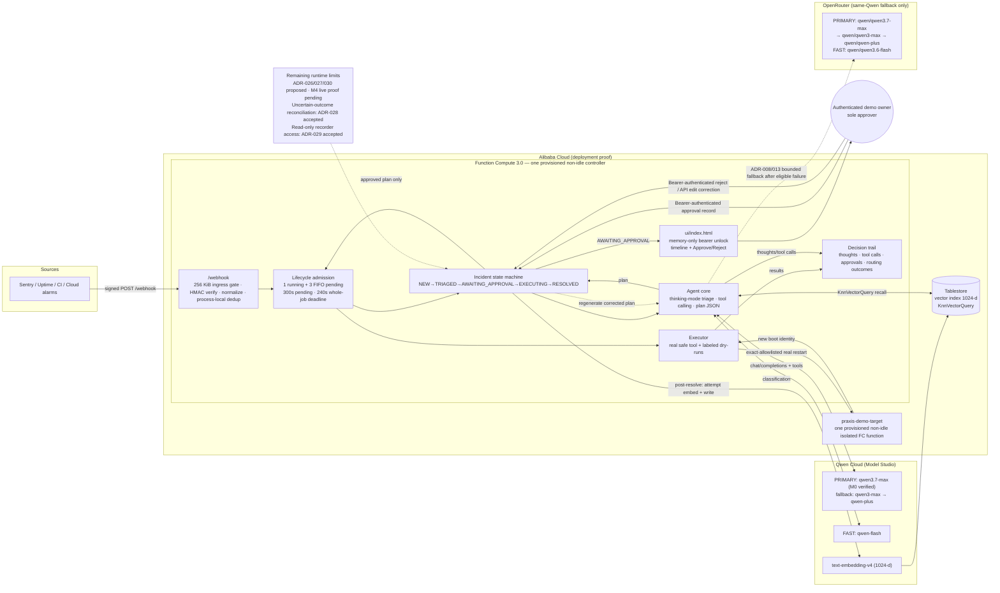

# ARCHITECTURE.md — Praxis

## Component diagram (mermaid — export to PNG at M5 for the submission)



## Request flow (happy path)

1. Alert source POSTs to `/webhook` with `X-Praxis-Signature` (HMAC-SHA256) and `X-Idempotency-Key`. A pure-ASGI ingress gate bounds declared and streamed request bodies at configurable `MAX_WEBHOOK_BODY_BYTES` (256 KiB default) before buffering, parsing, or persistence; oversize requests receive trace-correlated `413` (ADR-012).
2. Signature verified → payload normalized → one process-wide lifecycle lease acquired → Incident persisted (state NEW) → `202` returned in <500ms. Exactly one job may run and three may wait FIFO; a full boundary returns fixed trace-bearing `503` before idempotency or Incident mutation. A retained duplicate bypasses admission and returns its existing incident with no new run (FR-2, ADR-024).
3. On the provisioned non-idle controller, the lifecycle worker starts the agent run. Pending work expires after 300 seconds and a dequeued logical job has a 240-second whole-job deadline. The provider-specific fast role classifies severity/category (Qwen Cloud `qwen-flash`; OpenRouter fallback `qwen/qwen3.6-flash`, ADR-009); PRIMARY_MODEL (thinking mode) does root-cause + plan. Tool calls (read tools: fetch logs, service status) round-trip via function calling; every thought/call/result and each logical Qwen call's routing outcome is appended to the trail (FR-3..5, FR-12).
4. Memory recall: embed the incident summary, `KnnVectorQuery` top-1 from Tablestore; if similarity above threshold, inject prior resolution into the planning prompt and surface it in the UI (FR-11).
5. Plan validated against the strict pydantic contract → state AWAITING_APPROVAL (FR-6).
6. The operator unlocks the UI with a bearer token that exists only in page memory; the UI first calls `GET /session` to resolve its role, so a read-only viewer token (ADR-029) renders every incident without approve/reject controls. Authenticated approve, reject, and edit requests acquire lifecycle capacity before mutation; a full queue returns fixed `503` and records no Approval. On approve → EXECUTING: executor runs steps in order; `risk_level: safe` steps hit the real adapter, `caution|dangerous` hit labeled dry-run adapters (FR-6..9, ADR-025). Before the real adapter crosses its external boundary it durably records an ExecutionIntent (with the pre-action boot-id baseline); for each step the trail records `attempted` and then that step's validated result before the next attempt begins, and a failed result or result-recording failure blocks every later step. When a real action was dispatched but its outcome cannot be verified as succeeded, accepted ADR-028 moves the incident to the terminal RECONCILIATION_REQUIRED state — never a false success and never an automatic retry.
7. All steps succeed → RESOLVED → Praxis attempts to embed the summary and write IncidentMemory to Tablestore (FR-10). The current v1 attempt is non-fatal after resolution: success or unavailability is written to the trail, but a failed delivery is not yet retried.

## End-to-end incident sequence

```mermaid
sequenceDiagram
    autonumber
    participant S as Alert source
    participant C as Provisioned non-idle Alibaba FC controller
    participant Q as Qwen router
    participant QC as Qwen Cloud
    participant OR as OpenRouter (same Qwen only)
    participant TS as Tablestore
    participant H as Authenticated demo owner and UI
    participant X as Approved executor and isolated FC target

    S->>C: POST /webhook (body HMAC; separate unsigned v1 idempotency key)
    C-->>S: 202 incident snapshot (NEW)
    Note over C,Q: One active controller; 1 running + 3 FIFO pending; 300s pending and 240s whole-job deadlines (ADR-024)
    C->>Q: Classify with FAST_MODEL
    Q->>QC: qwen-flash completion
    alt Eligible Qwen Cloud failure (ADR-008)
        QC--xQ: auth / model / quota / 5xx / timeout
        Q->>OR: qwen/qwen3.6-flash fallback
        OR-->>Q: Same-Qwen classification
    else Qwen Cloud succeeds
        QC-->>Q: Classification
    end
    Q-->>C: Classification + trail evidence
    C->>QC: text-embedding-v4
    QC-->>C: 1024-d incident vector
    C->>TS: KnnVectorQuery (same service)
    TS-->>C: Top prior resolution or no match
    C->>Q: Root-cause + plan (thinking mode, read tools)
    Q->>QC: qwen3.7-max chain
    alt Eligible Qwen Cloud chain exhaustion
        QC--xQ: auth / model / quota / 5xx / timeout
        Q->>OR: Same-Qwen primary fallback chain
        OR-->>Q: Plan/tool response
    else Qwen Cloud primary succeeds
        QC-->>Q: Plan/tool response
    end
    Q-->>C: Strict validated remediation plan
    H->>C: Bearer-authenticated incident read (token held in page memory only)
    C-->>H: AWAITING_APPROVAL + full decision trail

    alt Owner approval recorded for this demo
        H->>C: Bearer-authenticated POST approve
        Note over C,X: Verified success → RESOLVED; uncertain post-dispatch outcome → RECONCILIATION_REQUIRED (ADR-028 accepted)
        C->>X: Execute immutable approved plan only
        X-->>C: Step results + isolated-target proof
        C->>C: RESOLVED
        C->>QC: Post-resolution text-embedding-v4 attempt
        alt Memory delivery succeeds
            QC-->>C: 1024-d resolution vector
            C->>TS: PutRow + search-visibility check
            C-->>H: RESOLVED + memory stored trail
        else Embedding or write unavailable
            C->>C: Record non-fatal memory failure
            C-->>H: RESOLVED + memory unavailable trail
        end
    else Owner rejects or edits this demo
        H->>C: Bearer-authenticated POST reject or API edit correction
        C->>Q: Regenerate without executing
        Q-->>C: Corrected validated plan
        C-->>H: AWAITING_APPROVAL again
    end

    Note over S,H: Active incidents and same-key dedup are process-local. After a stored row, a distinct recurrence can recall its incident ID and similarity; M4 live proof is pending.
```

The rendered SVG and PNG live beside the source as `docs/assets/praxis-incident-sequence.*`; regenerate them before publication because those exports may predate the accepted ADR-024/025 source above. This logical sequence makes the current boundaries explicit: OpenRouter may serve only the same Qwen family after an ADR-008-eligible Qwen Cloud failure; the body HMAC does not yet bind the separate v1 idempotency key, and the supplied key is not yet independently normalized or bounded; the operator role is application-authenticated and now joined by a separate read-only viewer role (ADR-029) resolved through `GET /session`, but its Approval and active incident remain process-local; the execution branch now covers the uncertain post-dispatch outcome by failing closed into RECONCILIATION_REQUIRED (ADR-028) rather than assuming success; and memory delivery is best-effort rather than retry-durable. ADR-024/025/028/029 are accepted and implemented in the working tree, but their public deployment and native/custom-origin probes are still required before a recording-ready claim. ADR-019/020 and ADR-026/027 remain proposed and unimplemented, and idempotency-boundary ADR-030 is a separate proposal that is also unimplemented. FR-10 and the owner-retained M4 write-plus-distinct-recurrence proof remain binding. Because the sequence is intentionally detailed, treat it as a zoomable technical reference rather than a full-frame 1080p video slide; use the component diagram for the architecture beat.

## Provider routing

ADR-008 requires `PROVIDER_ORDER=qwencloud,openrouter` in local development, Function Compute, rehearsals, and the demo. The agent exhausts the configured Qwen Cloud model chain first; it enters OpenRouter's same-Qwen chain only for an FR-12 auth/payment, unavailable-model, quota/rate-limit, 5xx, or timeout failure. Coding-plan credentials are excluded from the application backend; Praxis uses a general Model Studio API key.

ADR-013 bounds every provider/model attempt with a 15-second application-level wall-clock deadline around the complete HTTP operation, while every HTTPX connect/read/write/pool phase timeout is also at most 15 seconds. The client adds no inter-attempt delay and caps the complete logical call at 90 seconds, including transition and trail overhead. The accepted ADR-024 deployment config keeps the single provisioned controller active after an HTTP response, while its 240-second whole-job deadline independently bounds the logical job; the two-attempt fast route remains bounded to 30 seconds. The live verifier must still prove active capacity before the deployed revision is called recording-ready. Each actual transition retains its secret-safe `fallback` reason. One distinct `qwen_attempt` event closes the logical call at its successful or final failed pair with allowlisted provider, model, outcome, reason, and trace context; complete-budget expiry is recorded as `logical_timeout` without inventing a transition that was never attempted.

## State machine

| From | Event | To |
| --- | --- | --- |
| — | webhook accepted | NEW |
| NEW | agent produced classification | TRIAGED |
| TRIAGED | plan validated | AWAITING_APPROVAL |
| AWAITING_APPROVAL | bearer-authenticated approval decision recorded | EXECUTING |
| AWAITING_APPROVAL | operator reject with correction note | TRIAGED (regenerate; ADR-014) |
| AWAITING_APPROVAL | operator edit with step instructions | TRIAGED (regenerate; ADR-014) |
| EXECUTING | all steps ok | RESOLVED |
| EXECUTING | step failed | AWAITING_APPROVAL (with failure note) |

Invariant: **no transition into EXECUTING without an Approval record created through the authenticated operator boundary** (FR-6, ADR-006, ADR-025). Enforce in code, not convention.

PRD FR-7 takes precedence over the former terminal-reject row. Accepted ADR-014 specifies the exact correction payload, plan clearing, asynchronous regeneration, and server-owned single-operator attribution.

## Storage

Hackathon scope: incidents/trail/plans live in a process-local store behind a thin repository interface (`app/incidents.py`) and a real database can be swapped in later. Successfully written IncidentMemory is the only cross-restart persistence and lives in Tablestore; the current non-fatal delivery attempt is not retry-durable. The accepted ADR-024 manifests combine `instanceConcurrency: 1`, `concurrencyConfig.reservedConcurrency: 1`, and `provisionConfig` with `defaultTarget: 1` plus `alwaysAllocateCPU: true` for both controller and isolated target. Reserved concurrency caps capacity but does not itself keep vCPU active; the provisioned non-idle configuration supplies that lifecycle. Inside the controller, one process-wide FIFO admits one running and three pending jobs, expires pending work after 300 seconds, and caps a dequeued logical job at 240 seconds. A live control-plane probe must verify current provisioned capacity and reserved concurrency before recording. An FC recycle still clears active incidents, so stage the exact approval incident immediately before the human demo.

Tablestore schema mutation is separated from request handling: `scripts/provision_memory.py` idempotently creates and waits for the accepted table/index schema, while the Function Compute runtime only verifies that schema and performs bounded read/write/search operations. This keeps DDL permissions out of the steady-state request path and prevents index-creation readiness from stalling triage.

The controller function, and only the controller function, assumes the dedicated `praxis-fc-tablestore-role`. Its exact attachment set contains only the custom `PraxisFcTablestoreRuntime` policy, scoped to `praxis_memory` with `DescribeTable`, `ListSearchIndex`, `DescribeSearchIndex`, `PutRow`, and `Search`; schema DDL remains outside the runtime. `scripts/fc_role.py` performs read-before-write provisioning, fails on trust/policy/attachment-set drift, refuses to mutate a role with any extra system or custom attachment, and suppresses raw SDK output because signed request URLs can contain credential identifiers. Function Compute injects temporary access-key ID, secret, and security token values at runtime; no long-lived Alibaba credentials are rendered into `deploy/s.yaml`.

## Deployment

- `deploy/s.yaml` — Serverless Devs config: FC `custom.debian10` web runtime launching Uvicorn with the bundled Python 3.10 interpreter, HTTP trigger, env vars (including Qwen providers, webhook/operator/target secrets, model IDs, and Tablestore endpoint/instance), instance concurrency 1, reserved concurrency 1, one provisioned instance with `alwaysAllocateCPU: true`, memory 1024MB, timeout 120s. The same active-capacity and single-instance controls apply to `praxis-demo-target`.
- `deploy/target.s.yaml` — target-only bootstrap manifest used before the generated target URL exists. Set the token, run `bootstrap-target-verify` and `bootstrap-target-deploy`, copy the allowlisted URL into `PRAXIS_DEMO_TARGET_URL`, then use the complete `deploy/s.yaml`. Final verify/deploy and production startup require both URL and token, so a controller cannot report ready with the placeholder restart handler.
- Production startup validates provider credentials, the webhook signing secret, the operator token, and the isolated-target token before serving: blank, whitespace-containing, non-visible-ASCII, obvious-placeholder, short, low-diversity, or overlong bounded values fail closed, and validation errors name only the environment variable. `PRAXIS_OPERATOR_TOKEN` protects incident reads and decisions through constant-time bearer comparison after safe validation; root, health, and HMAC-signed webhook intake remain public. The target process applies the same 32–4096 visible-ASCII-character, eight-distinct-character token policy; its FC manifests set `APP_ENV=production`, so a missing or blank deployed token prevents startup. A missing local-development target token leaves `/restart` unavailable. Non-visible-ASCII request tokens fail closed before constant-time comparison. At HTTP request boundaries, fixed structured error events retain incident/trace context and exception type but omit exception messages and tracebacks so credential-bearing transport errors cannot leak into logs.
- `scripts/probe_fc.py` is the live capacity/configuration gate: for both controller and target it requires `alwaysAllocateCPU=true`, GPU allocation disabled, provisioned target/current equal to one, and reserved concurrency equal to one, in addition to the existing controller configuration checks. A successful deploy command without `configuration_matches=true` and `active_capacity_matches=true` is not recording readiness.
- FC auto-injects `ALIBABA_CLOUD_ACCESS_KEY_ID/SECRET` once an execution role is attached — used by the Tablestore SDK.
- `deploy/alibaba_proof.py` — single Qwen-Cloud-only file requiring the exact completion sentinel, the complete Tablestore schema, and matching live FC health markers before emitting allowlisted proof; linked in the Devpost submission (FR-15).
- `praxis.kopachelli.dev` is the canonical public edge: a DNS-only Cloudflare CNAME targets the account-scoped Alibaba FC regional endpoint, while the matching native FC custom-domain resource terminates HTTPS and routes `/*` to the `praxis-api` controller. This binding avoids the default `fcapp.run` browser-download header without adding a proxy or changing the application runtime. The generated FC trigger URL remains a deployment-diagnostic fallback, not the user-facing URL.
- The current TLS certificate was issued through DNS-01 and installed on the FC custom-domain resource without committing certificate or key material. Automated renewal is tracked separately in `PRAXIS-60`; proposed ADR-016 evaluates an Alibaba-managed lifecycle, but the current manual lifecycle remains binding until owner acceptance and eligibility confirmation.
